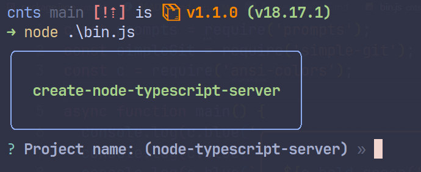

# `Create Node Typescript Server`

> 🧞‍♂️ Wanna create [a node typescript server](https://github.com/kauefraga/node-typescript-server)?

```bash
npx create-node-typescript-server
```

Different package manager?

```bash
yarn create node-typescript-server

pnpx create-node-typescript-server
```

Then you should see this:



And then:


If you don't enter some name... 🤡

## ☕ FAQ

#### Why did you choose this name?

Well, you know... [Create React App](https://create-react-app.dev)...

#### Any references/inspirations?

- [Create React App](https://create-react-app.dev)
- [How to build a CLI with Node.js](https://www.twilio.com/blog/how-to-build-a-cli-with-node-js)

## 📝 License

This project is licensed under the MIT License - See the [LICENSE](https://github.com/kauefraga/node-typescript-server/blob/main/LICENSE) for more information.
